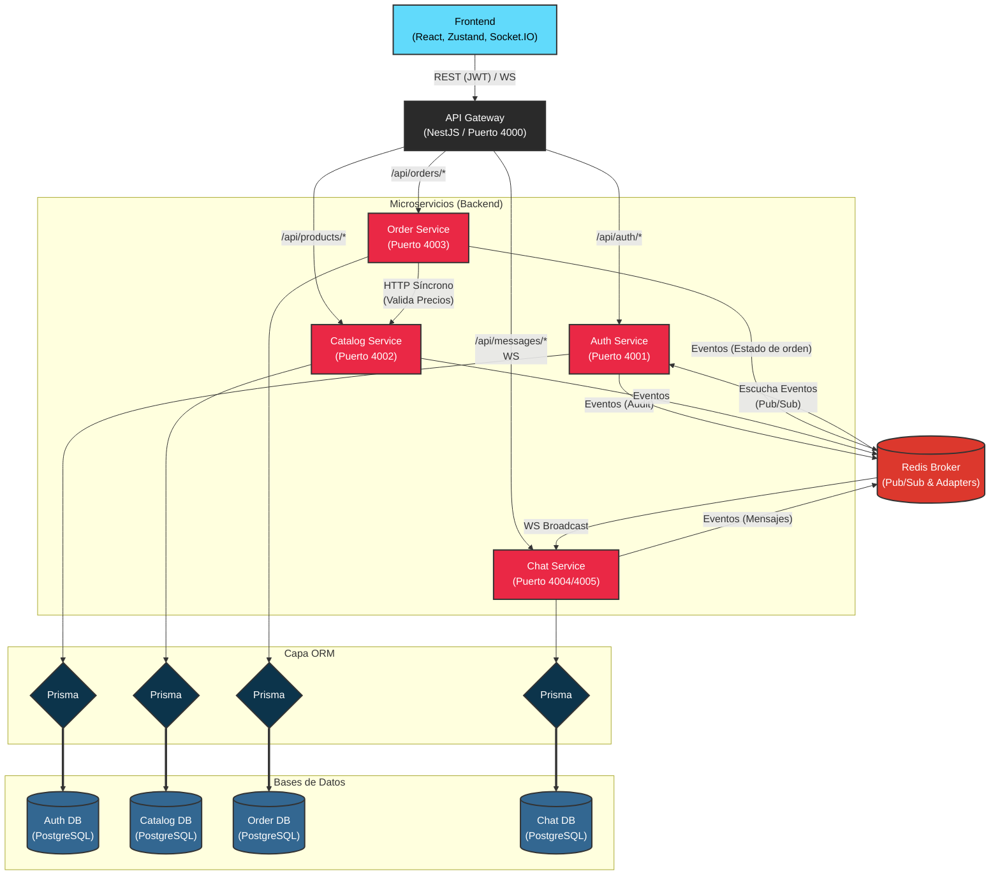

# Arquitectura de Dark Kitchens

Este diagrama ilustra la arquitectura de microservicios descrita en el documento `DECISIONES.md`.

## Patrones Destacados en el Diagrama

1. **API Gateway:** Único punto de entrada. Se encarga de validar el JWT y enrutar las peticiones al microservicio correspondiente inyectando `X-User-Id` y `X-User-Role`.
2. **Database per Service:** Cada microservicio gestiona su propia base de datos (PostgreSQL), promoviendo la autonomía y evitando problemas de consistencia en caso de fallos individuales.
3. **ORM (Prisma):** Se utiliza Prisma como mapeador objeto-relacional (ORM) para interactuar con las bases de datos de forma tipada, facilitando el esquema y las migraciones.
4. **Comunicación Síncrona (Circuit Breaker):** El `Order Service` valida los precios y la disponibilidad con una llamada HTTP directa hacia el `Catalog Service`. 
5. **Comunicación Asíncrona (Eventos):** Un servidor Redis centralizado permite notificar eventos entre servicios sin acoplarlos (como la generación asíncrona de registros de auditoría o eventos de notificación en tiempo real).
